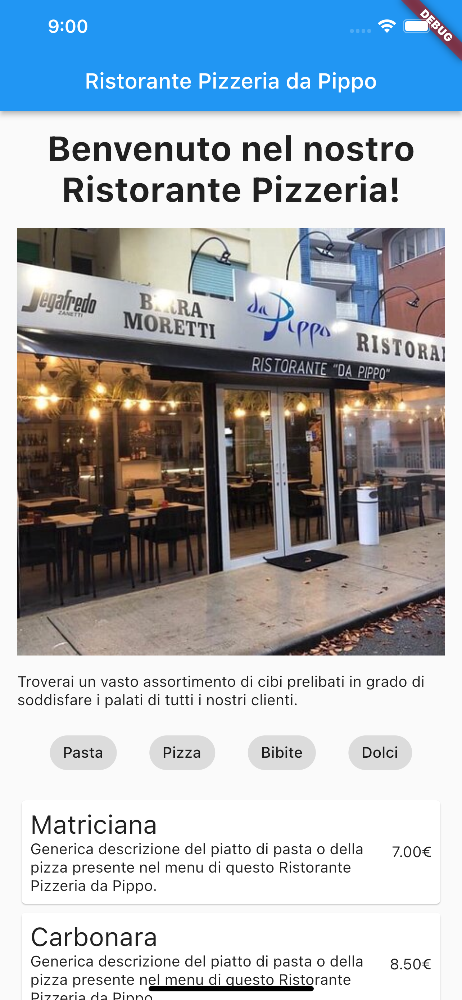

# Esercizio 2 - Prima app in Flutter

- Creare l’app del Ristorante Pizzeria da Pippo
- Cercare di replicare la schermata in base ai seguenti screenshot
- Non ci sono misure o testi da rispettare, l’esercitazione serve ad iniziare a conoscere i principali Widget e saperli posizionare in modo opportuno nella pagina

Screen 1 | Screen 2
:-:|:-:
 | 
